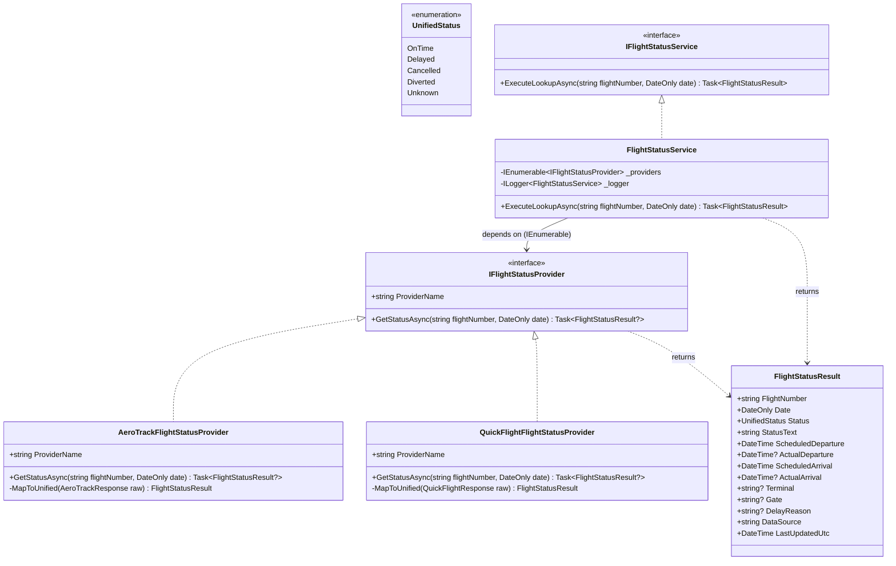

# Flight Status Lookup - Technical Specification & Architecture Design

This specification defines the system architecture, class relationships, interfaces, and service responsibilities for the Flight Status lookup platform.

---

## 1. System Architecture Diagram (Mermaid)

The following diagram illustrates the relationships and interactions between the components in the system, demonstrating the **Strategy Pattern** for providers and the **Service Layer** pattern for orchestration.



---

## 2. Directory & Folder Structure

To ensure separation of concerns, the backend is organized into functional folders:

```text
FlightStatus.Api/
├── Domain/
│   ├── Enums/
│   │   └── UnifiedStatus.cs             # The unified status enum
│   └── Models/
│       └── FlightStatusResult.cs        # Unified domain model returned by service/providers
├── Dtos/
│   ├── AeroTrackResponse.cs             # Raw model returned by AeroTrack stub
│   └── QuickFlightResponse.cs           # Raw model returned by QuickFlight stub
├── Providers/
│   ├── IFlightStatusProvider.cs         # Strategy interface for providers
│   ├── AeroTrackFlightStatusProvider.cs # Concrete implementation for AeroTrack
│   └── QuickFlightFlightStatusProvider.cs# Concrete implementation for QuickFlight
├── Services/
│   ├── IFlightStatusService.cs         # Core orchestration service interface
│   └── FlightStatusService.cs           # Business logic and coordination implementation
├── Program.cs                           # Minimal API router & DI container registration
└── appsettings.json                     # Environment configurations
```

---

## 3. Core Interface Contracts

### 3.1. `IFlightStatusProvider` (Strategy Pattern)
Each external provider implements this contract. It isolates provider-specific HTTP calls and mapping logic from the core business services.

```csharp
namespace FlightStatus.Api.Providers;

using FlightStatus.Api.Domain.Models;

public interface IFlightStatusProvider
{
    /// <summary>
    /// Friendly name of the data source provider (e.g. "AeroTrack").
    /// </summary>
    string ProviderName { get; }

    /// <summary>
    /// Fetches flight status details from the provider and maps it to the unified domain schema.
    /// Returns null if the flight is not found, or if the provider returns no usable data.
    /// </summary>
    Task<FlightStatusResult?> GetStatusAsync(string flightNumber, DateOnly date);
}
```

### 3.2. `IFlightStatusService` (Orchestration Service Layer)
The endpoint calls this service to perform the business orchestrations.

```csharp
namespace FlightStatus.Api.Services;

using FlightStatus.Api.Domain.Models;

public interface IFlightStatusService
{
    /// <summary>
    /// Queries all registered providers in parallel, applies conflict resolution, 
    /// and handles failures gracefully.
    /// </summary>
    /// <exception cref="ArgumentException">Thrown when input validation fails.</exception>
    Task<FlightStatusResult> ExecuteLookupAsync(string flightNumber, DateOnly date);
}
```

---

## 4. Component Responsibilities

### 4.1. Minimal API Endpoint Handler (`Program.cs`)
* **Input Validation**: Ensures query parameters (`flightNumber` and `date`) are provided and valid; returns a `400 Bad Request` immediately if validation fails.
* **Orchestration**: Calls the `IFlightStatusService` dependency.
* **Response Generation**: Formats and returns a `200 OK` JSON response containing the unified model, or a `404 Not Found` if the flight status is unknown/unavailable.

### 4.2. Orchestration Service (`FlightStatusService`)
* **Concurrency**: Fires requests to all registered `IFlightStatusProvider` instances concurrently using `Task.WhenAll`.
* **Selection Logic**:
  - If **both** providers return a result, selects the one with the latest `LastUpdatedUtc` timestamp.
  - If **only one** provider returns a result, uses that result.
  - If **neither** returns a result (or both throw exceptions), returns a result with `UnifiedStatus.Unknown` and logs the outcome.
* **Error Resilience**: Catches exceptions thrown by individual providers so that one failing provider does not bring down the entire API request.

### 4.3. Concrete Providers (`AeroTrackFlightStatusProvider` & `QuickFlightFlightStatusProvider`)
* **Data Fetching**: Stubs out data access (simulating network latency and raw database/external HTTP results).
* **DTO Mapping**: Converts raw, vendor-specific DTOs (`AeroTrackResponse` and `QuickFlightResponse`) into the unified `FlightStatusResult` model.

---

## 5. Dependency Flow (Dependency Inversion Principle)

The system adheres strictly to the **Dependency Inversion Principle (DIP)**:
1. High-level endpoint routing does not depend on concrete providers. It depends solely on the `IFlightStatusService` interface.
2. The core `FlightStatusService` does not depend on concrete provider classes. Instead, it accepts an `IEnumerable<IFlightStatusProvider>` in its constructor, injected by the built-in DI container.
3. Adding a new flight data provider requires only writing a new class implementing `IFlightStatusProvider` and registering it in `Program.cs`. No changes are required to the service or endpoints.

```text
[HTTP GET Endpoint]
        │
        ▼ (Depends on)
[IFlightStatusService]
        │
        ▼ (Implemented by)
[FlightStatusService]
        │
        ▼ (Depends on Collection of)
[IFlightStatusProvider]
   ├── AeroTrackFlightStatusProvider  ── (Maps) ──> AeroTrackResponse (Raw DTO)
   └── QuickFlightFlightStatusProvider ── (Maps) ──> QuickFlightResponse (Raw DTO)
```
